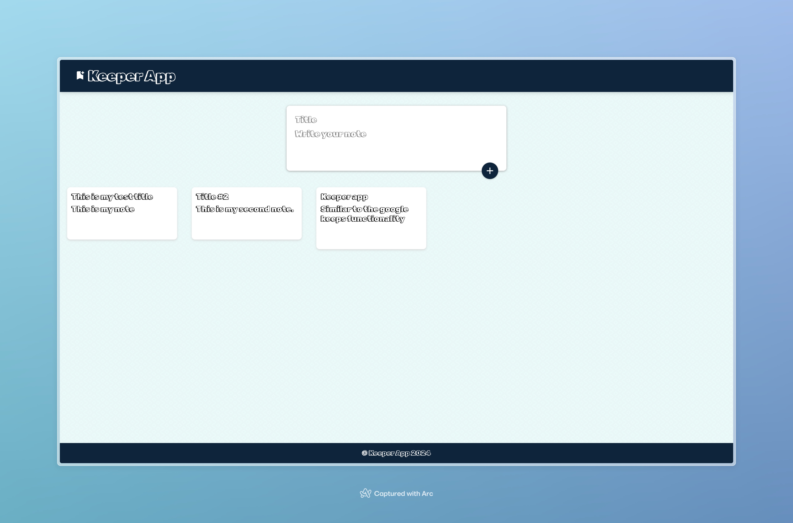

# Keeper App



Keeper App is a simple notes-taking application built with ReactJS and Material UI icons. It allows users to create, edit, and delete notes, providing a user-friendly experience for organizing information.

## Table of Contents
- [Features](#features)
- [Tech Stack](#tech-stack)
- [Installation](#installation)
- [Usage](#usage)
- [Contributing](#contributing)

## Features
- Create, and delete notes.
- User-friendly interface with Material UI icons.

## Tech Stack
- ReactJS
- Material UI

## Installation
1. Fork the repository
2. Clone the repository
3. After cloning the repository:
   ```
  git clone https://github.com/your-username/keeper-app.git
  cd keeper-app
  npm install
  npm start 
  ```

## Contributions
Contributions are welcome! Feel free to open an issue or submit a pull request.
